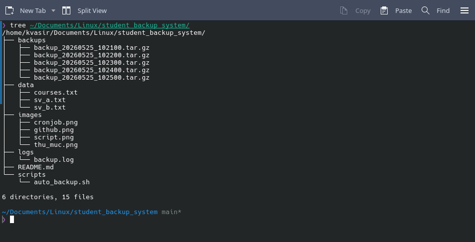
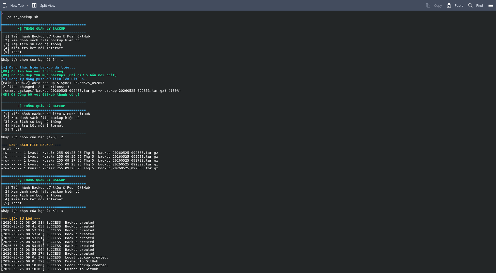
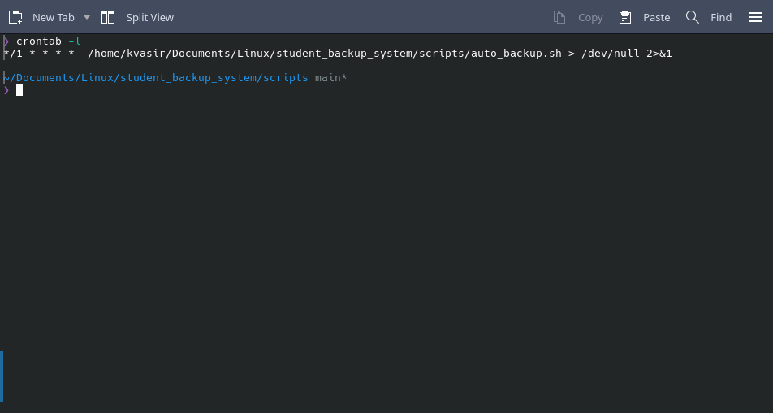
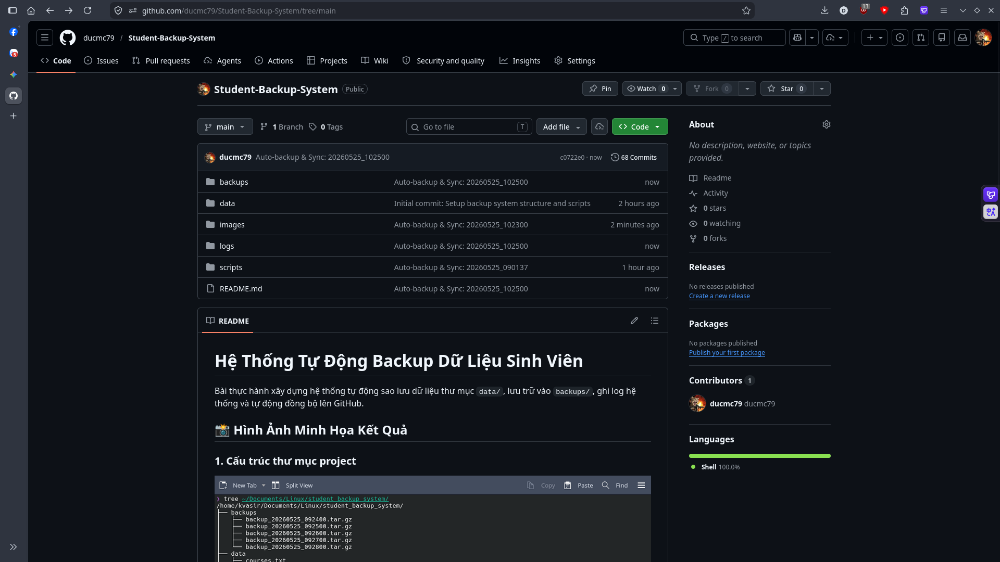

# Hệ Thống Tự Động Backup Dữ Liệu Sinh Viên

Bài thực hành xây dựng hệ thống tự động sao lưu dữ liệu thư mục `data/`, lưu trữ vào `backups/`, ghi log hệ thống và tự động đồng bộ lên GitHub.

## 📸 Hình Ảnh Minh Họa Kết Quả

### 1. Cấu trúc thư mục project

### 2. Kết quả chạy Script (Menu màu sắc)

### 3. Cấu hình Cronjob (Tự động chạy mỗi 1 phút)

### 4. Giao diện Repository GitHub

---
*Sinh viên thực hiện: Ly Minh Duc*
